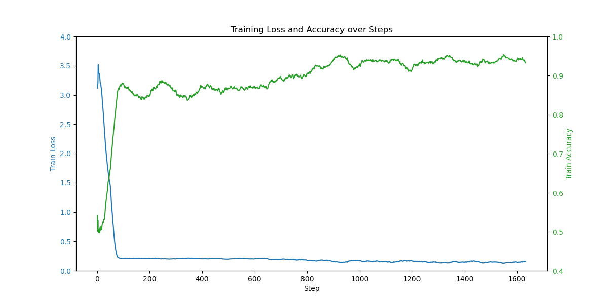
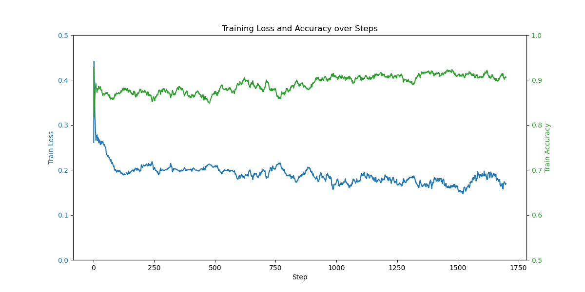

# FineTune_GPT3.5Turbo_StockForecasting

This project investigates the performance of fine-tuning OpenAI’s GPT-3.5 Turbo for stock price forecasting. Experiments on the Bigdata22 and CIKM18 datasets demonstrate that fine-tuning can improve both accuracy and F1-score. However, the results still fall short compared to traditional models, highlighting the importance of further domain-specific optimization in financial NLP.

## 📄 Related Paper

This project is associated with the following paper:

**The Limits of Excellence: Assessing Fine-tuned ChatGPT’s Efficacy in Stock Price Forecasting**  
[📄 View PDF](./The%20Limits%20of%20Excellence%20Assessing%20Fine-tuned%20ChatGPT%E2%80%99s%20Efficacy%20in%20Stock%20Price%20Forecasting.pdf)

## 📊 Results Visualization

### 📈 F1 Score Comparison

### 📉 Model Accuracy Over Epochs

